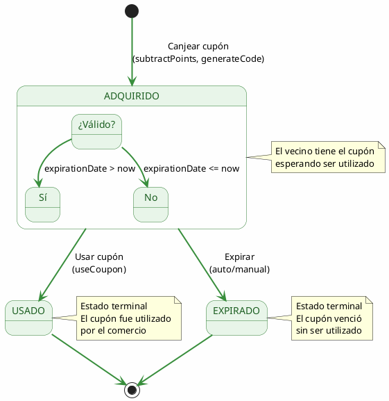

# CouponTransaction State Machine

Este documento describe la máquina de estados implementada para el ciclo de vida de los cupones canjeados por los vecinos.

## Estados

### 1. `ADQUIRIDO` (Acquired)

**Descripción**: El cupón ha sido canjeado por el vecino y está disponible para ser utilizado.

**Propiedades**:

- `canUse()`: `true` - Puede ser utilizado si no está expirado
- `canExpire()`: `true` - Puede expirar

**Transiciones válidas**:

- → `USADO` (cuando el comercio lo utiliza)
- → `EXPIRADO` (cuando supera la fecha de vencimiento)

### 2. `USADO` (Used)

**Descripción**: El cupón ha sido utilizado por el comercio partner.

**Propiedades**:

- `canUse()`: `false` - No puede ser reutilizado
- `canExpire()`: `false` - Ya no puede expirar

**Transiciones válidas**:

- Ninguna (estado terminal)

### 3. `EXPIRADO` (Expired)

**Descripción**: El cupón ha superado su fecha de vencimiento sin ser utilizado.

**Propiedades**:

- `canUse()`: `false` - No puede ser utilizado
- `canExpire()`: `false` - Ya está en estado final

**Transiciones válidas**:

- Ninguna (estado terminal)

## Diagrama de Estados (PlantUML)



## Diagrama de Transiciones

```
┌─────────────────────────────────────────────────────────────┐
│                    CUPON TRANSACTION                         │
│                    STATE MACHINE                            │
└─────────────────────────────────────────────────────────────┘

                         ┌──────────────┐
                         │   ADQUIRIDO  │
                         │   (Initial)  │
                         └──────┬───────┘
                                │
           ┌────────────────────┼────────────────────┐
           │                    │                    │
           ▼                    ▼                    ▼
    ┌─────────────┐      ┌─────────────┐      ┌─────────────┐
    │ canUse()    │      │  USADO      │      │  EXPIRADO   │
    │ = true      │      │  (Final)   │      │  (Final)   │
    │ canExpire() │      │             │      │             │
    │ = true      │      │ canUse()    │      │ canUse()    │
    └──────┬──────┘      │ = false    │      │ = false    │
           │              │ canExpire() │      │ canExpire() │
           │              │ = false    │      │ = false    │
           ▼              └─────────────┘      └─────────────┘
    ┌─────────────┐            │                    │
    │ useCoupon() │◄───────────┘                    │
    │ RedeemDate  │◄───────────────────────────────┘
    │ = now       │
    └─────────────┘
```

## Flujo Completo

### 1. Canje (Redeem)

```
Vecino → canjea cupón con puntos
    ↓
Verificar puntos suficientes
    ↓
Verificar cupón disponible (isAvailable)
    ↓
Verificar estado del cupón (state !== 'ADQUIRIDO')
    ↓
Restar puntos al vecino
    ↓
Actualizar estado del cupón → 'ADQUIRIDO'
    ↓
Crear CouponTransaction con:
  - status: 'ADQUIRIDO'
  - code: 6 dígitos aleatorios
  - expirationDate: hoy + validDays
  - adquisitionDate: hoy
```

### 2. Uso (Use)

```
Comercio → escanea código del cupón
    ↓
Buscar transacción por código
    ↓
Verificar que el comercio es el dueño
    ↓
Verificar estado === 'ADQUIRIDO'
    ↓
Verificar !expirado (expirationDate > now)
    ↓
Verificar State Machine: canUse() === true
    ↓
Calcular descuento:
  finalAmount = totalAmount - (totalAmount * discount) / 100
    ↓
Actualizar transacción:
  - status: 'USADO'
  - redeemDate: ahora
```

### 3. Expiración

```
Sistema → verifica cupones expirados
    ↓
Verificar expirationDate <= now
    ↓
Verificar State Machine: canExpire() === true
    ↓
Actualizar estado → 'EXPIRADO'
```

## Implementación

### Archivos del State Pattern

```
src/coupon-transaction/domain/states/
├── index.ts                              # Exports públicos
├── coupon-transaction-state.interface.ts # Interfaces
├── coupon-transaction-states.ts          # Estados concretos
└── coupon-transaction-state-machine.ts   # Máquina de estados
```

### Uso en Use Cases

```typescript
// use-coupon.usecase.ts
const stateMachine = new CouponTransactionStateMachine(transaction.status)
stateMachine.setExpirationDate(transaction.expirationDate)

if (!stateMachine.canUse()) {
  if (stateMachine.isExpired()) {
    throw new Error('El cupón ha expirado.')
  }
  throw new Error('El cupón no está disponible para usar.')
}

// Si puede usar, actualizar estado
transaction.status = CouponTransactionStatus.USADO
```

## Beneficios del State Pattern

1. **Encapsulamiento**: Cada estado tiene su propia lógica
2. **Transiciones controladas**: Solo se pueden hacer transiciones válidas
3. **Validación централизована**: El estado sabe qué puede hacer
4. **Fácil extensión**: Agregar nuevos estados sin modificar existentes
5. **Tests más simples**: Cada estado puede probarse aisladamente

## Estados Futuros Posibles

- `CANCELADO`: Cupón cancelado por el comercio o el sistema
- `BLOQUEADO`: Cupón temporalmente bloqueado
- `TRANSFERIDO`: Cupón transferido a otro vecino

---

## Cómo Agregar un Nuevo Estado

Para agregar un nuevo estado (ejemplo: `CANCELADO`), seguir estos pasos:

### Paso 1: Agregar el valor al enum

En `coupon-transaction-state.interface.ts`:

```typescript
export enum CouponTransactionStatus {
  ADQUIRIDO = 'ADQUIRIDO',
  USADO = 'USADO',
  EXPIRADO = 'EXPIRADO',
  CANCELADO = 'CANCELADO' // ← Nuevo estado
}
```

### Paso 2: Crear la clase del estado

En `coupon-transaction-states.ts`:

```typescript
export class CanceledState implements CouponTransactionState {
  readonly status: CouponTransactionStatus = CouponTransactionStatus.CANCELADO

  canUse(): boolean {
    return false
  }

  canExpire(): boolean {
    return false
  }

  use(): void {
    throw new Error('El cupón ha sido cancelado y no puede ser utilizado')
  }

  expire(): void {
    throw new Error('El cupón ha sido cancelado y no puede expirar')
  }

  cancel(context: CouponTransactionStateContext): void {
    throw new Error('El cupón ya ha sido cancelado')
  }
}
```

### Paso 3: Actualizar la interfaz (si hay nuevas transiciones)

En `coupon-transaction-state.interface.ts`:

```typescript
export interface CouponTransactionState {
  readonly status: CouponTransactionStatus

  canUse(): boolean
  canExpire(): boolean
  canCancel(): boolean // ← Nueva acción
  use(context: CouponTransactionStateContext): void
  expire(context: CouponTransactionStateContext): void
  cancel(context: CouponTransactionStateContext): void // ← Nueva acción
}
```

### Paso 4: Actualizar estados existentes

Modificar los estados desde los cuales se puede cancelar (ej: `AcquiredState`):

```typescript
export class AcquiredState implements CouponTransactionState {
  // ... código existente ...

  canCancel(): boolean {
    return true
  }

  cancel(context: CouponTransactionStateContext): void {
    context.setState(new CanceledState())
  }
}
```

### Paso 5: Actualizar la State Machine

En `coupon-transaction-state-machine.ts`:

```typescript
export class CouponTransactionStateMachine implements CouponTransactionStateContext {
  // ... código existente ...

  cancel(): void {
    if (!this.state.canCancel()) {
      throw new Error('El cupón no puede ser cancelado en su estado actual')
    }
    // Llamar al método del estado actual
    ;(this.state as any).cancel(this)
  }
}
```

### Paso 6: Actualizar el factory

En `coupon-transaction-states.ts`, agregar al switch de `createStateFromStatus`:

```typescript
export function createStateFromStatus(status: CouponTransactionStatus): CouponTransactionState {
  switch (status) {
    case CouponTransactionStatus.ADQUIRIDO:
      return new AcquiredState()
    case CouponTransactionStatus.USADO:
      return new UsedState()
    case CouponTransactionStatus.EXPIRADO:
      return new ExpiredState()
    case CouponTransactionStatus.CANCELADO: // ← Nuevo caso
      return new CanceledState()
    default:
      throw new Error(`Estado desconocido: ${String(status)}`)
  }
}
```

### Paso 7: Crear el caso de uso (opcional)

Crear `cancel-coupon.usecase.ts` si necesitás lógica de negocio adicional.

### Resumen de Archivos a Modificar

| Archivo                                 | Cambio                                                |
| --------------------------------------- | ----------------------------------------------------- |
| `coupon-transaction-state.interface.ts` | Agregar enum y actualizar interfaz                    |
| `coupon-transaction-states.ts`          | Crear clase + actualizar factory + estados existentes |
| `coupon-transaction-state-machine.ts`   | Agregar método cancel (si aplica)                     |
